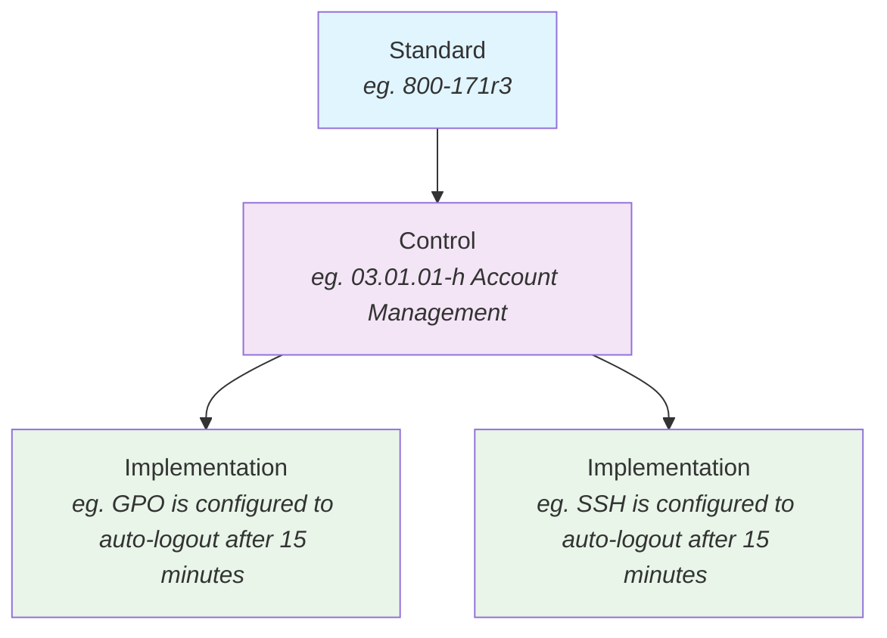
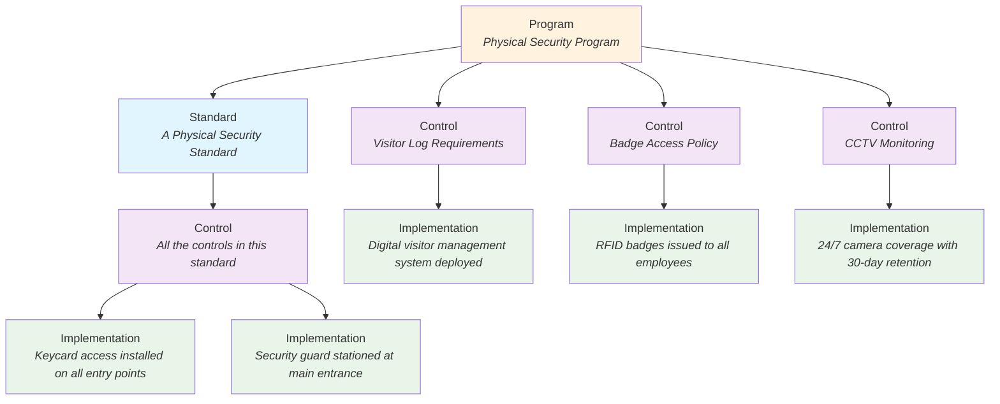

## Key Terms

These are the things you MUST know to effectively use OpenGRC. This should be considered required-reading for all OpenGRC users.

## Standards
Security standards are a set of guidelines and best practices designed to safeguard systems, networks, and data from various cyber threats. They establish a baseline for implementing and measuring effective security controls within organizations. These standards cover a broad range of areas including network security, data encryption, access control, and vulnerability management. By adhering to these standards, organizations can protect themselves against unauthorized access, data breaches, and other cyber threats, thereby ensuring the confidentiality, integrity, and availability of their information assets. Common examples of security standards include ISO/IEC 27001, which provides a framework for information security management systems, and the Payment Card Industry Data Security Standard (PCI DSS), which outlines security measures for organizations handling credit card transactions.

## Controls
A security control is a safeguard or countermeasure designed to protect the confidentiality, integrity, and availability of information systems and data. These controls can be physical, technical, or administrative in nature. Physical controls include measures like locks and surveillance cameras to secure physical assets. Technical controls, often software or hardware-based, include firewalls, encryption, and antivirus programs, aimed at protecting digital assets from cyber threats. Administrative controls consist of policies, procedures, and training that govern user behavior and operational procedures. Together, these controls form a comprehensive defense against a wide range of security threats, from unauthorized access and data breaches to internal policy violations. In a world where digital threats are constantly evolving, the implementation and continuous refinement of these security controls are crucial for maintaining the overall security posture of an organization.

### Control Types (What the Control is...)
* **Administrative:** Controls managed by people or organizational processes (e.g., policies, training, incident response plans).
* **Operational:** Controls that are implemented and enforced by day-to-day processes (e.g., backups, physical security).
* **Technical:** Controls implemented through technology (e.g., firewalls, encryption, access control systems).

### Control Categories (What the Control does...)
* **Preventative:** Controls designed to prevent security incidents (e.g., firewalls, access controls, encryption).
* **Detective:** Controls aimed at identifying or detecting security incidents (e.g., intrusion detection systems, log monitoring, audit trails).
* **Corrective:** Controls that respond to and fix security issues once detected (e.g., patching systems, disaster recovery plans).
* **Deterrent:** Controls that dissuade malicious actors from attempting security breaches (e.g., warnings, legal penalties).
* **Compensating:** Controls that mitigate the risk of a vulnerability or weakness when other controls can't fully address it (e.g., encryption compensating for weak authentication).
* **Recovery:** Controls designed to restore operations after an incident (e.g., backups, business continuity planning).

### Control Enforcement Categories (How the Control is enforced...)
* **Mandatory:** The control is required and must be implemented exactly as specified by the framework. There is no flexibility in its implementation.
* **Addressable:** The control is recommended, but an organization may either implement it as specified, implement a compensating control, or justify why it is not applicable.

## Implementations
Implementations are the actual means and methods we use to implement a control. Implementations relate to one or many controls and can satisfy the requirements of a control in various ways. For example, a control that requires a password to be at least 8 characters long can be implemented by configuring a system to enforce this requirement using a specific procedure or technology.

## Programs
Programs are the highest level of organization in OpenGRC. Programs are used to group together related Standards, Controls, Implementations, and Audits. In OpenGRC, a program is **optional** and simply a container for multiple standards OR controls. A good example for a usecase is, for example, CMMC. CMMC is a combination of the 800-171, 800-172, as well as various laws from the FAR and DFARS. Grouping them all together under one Program allows you to easily manage, audit, and report them all together.

Another great example is when you want to group controls and standards for a functional area, like Physical Security. This allows you to Audit, Report, and assign ownership of specific controls and implementations to an individual or a department. When you create this program, it's ONLY a container - when controls are updated in the Program, they are live across the entire environment. In that way, you could audit physical security, and have the results be part of other larger audits.

**As a reminder, using the program feature is optional.** You can still create and manage Standards, Controls, Implementations, and Audits without using a Program.